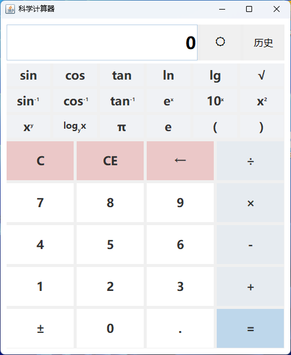

# Java Scientific Calculator / Java 科学计算器

[English](#english) | [中文](#chinese)

<a name="english"></a>

## 🇬🇧 English

### Overview
A robust scientific calculator application built with Java Swing, featuring a custom recursive descent parser for accurate expression evaluation.

### Features

*   **Scientific Functions**: Support for trigonometric functions (sin, cos, tan, asin, acos, atan), logarithms (ln, log, log base), powers, roots, factorial, and constants (π, e).
*   **Smart Parsing**: Implements a **Recursive Descent Parser** to handle complex expressions and operator precedence correctly (e.g., `2 * (3 + 4)`).
*   **History Management**:
    *   Expandable side panel for calculation history.
    *   Select and delete specific history entries via checkboxes.
    *   Clear all history functionality.
*   **Theme Support**: Toggle between a clean, muted Light Mode and a comfortable Dark Mode.
*   **Responsive Design**: The window automatically expands and contracts when the history panel is toggled.

### Screenshots
<p align="center">
  
  &nbsp; &nbsp;
  
</p>

### Download & Install
You can download the latest executable version from the [Releases](../../releases) page.
*   **Windows**: Download `Java-Scientific-Calculator.exe` and double-click to run.
*   **Cross-Platform**: Download `calculator.jar` and run with `java -jar calculator.jar`.
*   *Note: Java Runtime Environment (JRE) is required.*

### How to Run

#### Prerequisites
*   Java Development Kit (JDK) 8 or higher.

#### From Command Line
1.  Navigate to the project root directory.
2.  Compile the source code:
    ```bash
    javac -encoding UTF-8 -cp src -d bin src/calculator/Calculator.java
    ```
3.  Run the application:
    ```bash
    java -cp bin calculator.Calculator
    ```

#### In Eclipse
1.  Import the project folder into your Eclipse workspace.
2.  Right-click on `src/calculator/Calculator.java`.
3.  Select **Run As** -> **Java Application**.

---

<a name="chinese"></a>

## 🇨🇳 中文

### 概述
一个基于 Java Swing 构建的功能强大的科学计算器，内置自定义递归下降解析器，可精确评估复杂的数学表达式。

### 功能特点

*   **科学计算**: 支持三角函数（sin, cos, tan, asin, acos, atan）、对数（ln, log, log base）、指数、根号、阶乘以及常数（π, e）等运算。
*   **智能解析**: 实现了**递归下降解析器 (Recursive Descent Parser)**，能够正确处理复杂的表达式和运算符优先级（例如 `2 * (3 + 4)`）。
*   **历史记录管理**:
    *   可展开/折叠的侧边历史记录面板。
    *   支持通过复选框勾选删除特定的历史记录条目。
    *   一键清空所有历史记录。
*   **主题支持**: 支持在素雅的浅色模式和舒适的深色模式之间一键切换。
*   **响应式设计**: 切换历史记录显示时，窗口宽度会自动调整以适应布局。

### 截图预览
<p align="center">
  
  &nbsp; &nbsp;
  
</p>

### 下载与安装
您可以从 [Releases](../../releases) 页面下载最新的可执行版本。
*   **Windows 用户**: 下载 `Java-Scientific-Calculator.exe` 并双击运行。
*   **跨平台用户**: 下载 `calculator.jar` 并通过命令 `java -jar calculator.jar` 运行。
*   *注意：运行程序需要安装 Java 运行环境 (JRE)。*

### 如何运行

#### 前置条件
*   Java Development Kit (JDK) 8 或更高版本。

#### 命令行运行
1.  进入项目根目录。
2.  编译源代码（指定 UTF-8 编码以防止乱码）：
    ```bash
    javac -encoding UTF-8 -cp src -d bin src/calculator/Calculator.java
    ```
3.  运行程序：
    ```bash
    java -cp bin calculator.Calculator
    ```

#### 在 Eclipse 中运行
1.  将项目文件夹导入到您的 Eclipse 工作空间。
2.  在 `src/calculator/Calculator.java` 文件上点击右键。
3.  选择 **Run As** -> **Java Application**。
